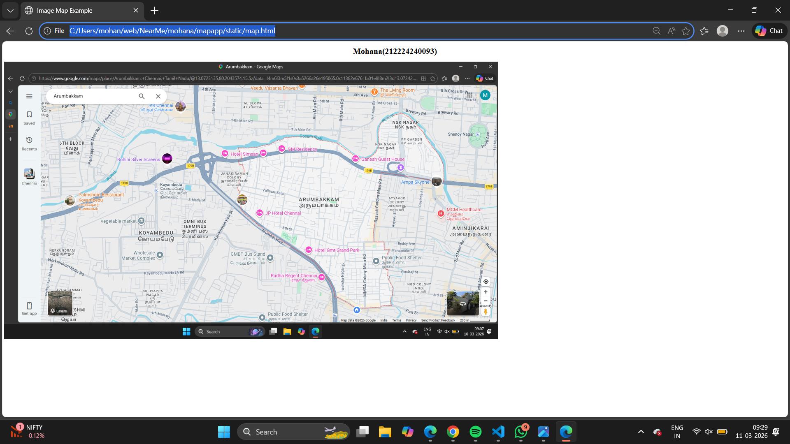

# Ex03 Places Around Me
## Date: 

## AIM
To develop a website to display details about the places around my house.

## DESIGN STEPS

### STEP 1
Create a Django admin interface.

### STEP 2
Download your city map from Google.

### STEP 3
Using ```<map>``` tag name the map.

### STEP 4
Create clickable regions in the image using ```<area>``` tag.

### STEP 5
Write HTML programs for all the regions identified.

### STEP 6
Execute the programs and publish them.

## CODE
```
<!DOCTYPE html>
<html>
<head>
    <title>Image Map Example</title>
</head>
<body>

<center><h1>Mohana(212224240093)</h1></center>


<map name="image-map">

    <area shape="rect"
          coords="875,227,952,264"
          href="file1.html"
          alt="Rectangle"
          title="Open File 1">

    <area shape="poly"
          coords="397,202,568,207,411,259,527,261,567,208,402,249"
          href="file2.html"
          alt="Polygon"
          title="Open File 2">

    <area shape="circle"
          coords="1570,131,79"
          href="file3.html"
          alt="Circle 1"
          title="Open File 3">

</map>

</body>
</html>
```

FILE1:
```
<!DOCTYPE html>
<html>
<head>
    <title>Rohini Theater</title>
</head>
<body>
    <h1>Rohini Theater</h1>
    <p>
        Rohini Theater is a popular cinema theater located in Koyambedu, Chennai.
        It is well known for screening the latest Tamil and other language movies.
        The theater has modern facilities with large screens and good sound systems.
        Many people visit Rohini Theater for entertainment and watching new films.
        It is one of the famous theaters in the area.
    </p>

    <a href="map.png">Go Back to Map</a>
</body>
</html>
```
FILE2:
```
<!DOCTYPE html>
<html>
<head>
    <title>Public Food Shelter</title>
</head>
<body>
    <h1>Public Food Shelter</h1>
    <p>
        Public Food Shelters are places where food is provided for people in need.
        These shelters help poor and homeless individuals by offering free or
        affordable meals. Many volunteers and charitable organizations support
        these centers to serve the community. They play an important role in
        reducing hunger and helping people during difficult times.
    </p>

    <a href="map.png">Go Back to Map</a>
</body>
</html>
```
FILE3:
```
<!DOCTYPE html>
<html>
<head>
    <title>CMBT Bus Stand</title>
</head>
<body>
    <h1>CMBT Bus Stand</h1>
    <p>
        Chennai Mofussil Bus Terminus (CMBT) is one of the largest bus terminals in Chennai.
        It is located in Koyambedu and serves as a major hub for intercity and interstate buses.
        Thousands of passengers travel from CMBT every day to different parts of Tamil Nadu
        and neighboring states. The bus stand has facilities like waiting halls, food stalls,
        ticket counters, and parking areas. It is an important transportation center in the city.
    </p>

    <a href="map.png">Go Back to Map</a>
</body>
</html>
```


## OUTPUT



.png>)

.png>)

.png>)


## RESULT
The program for implementing image maps using HTML is executed successfully.
